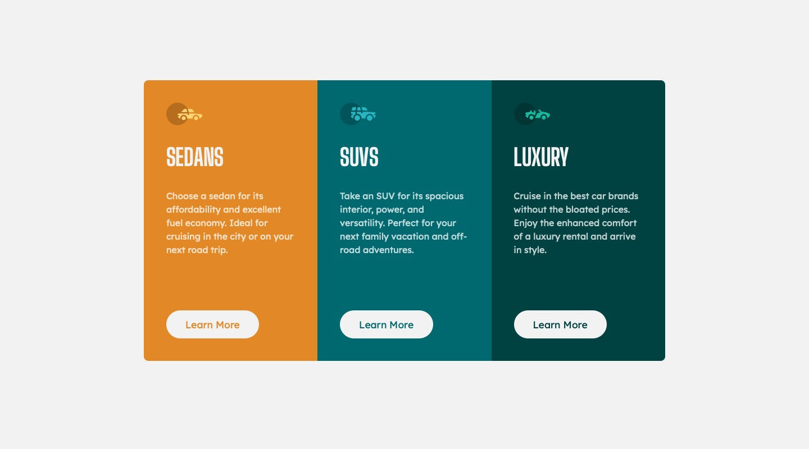

# Frontend Mentor - 3-column preview card component solution

This is a solution to the [3-column preview card component challenge on Frontend Mentor](https://www.frontendmentor.io/challenges/3column-preview-card-component-pH92eAR2-). Frontend Mentor challenges help you improve your coding skills by building realistic projects. 

## Table of contents

- [Overview](#overview)
  - [Screenshot](#screenshot)
  - [Links](#links)
- [My process](#my-process)
  - [Built with](#built-with)
  - [What I learned](#what-i-learned)
  - [Continued development](#continued-development)
  - [Useful resources](#useful-resources)
- [Author](#author)
- [Acknowledgments](#acknowledgments)

## Overview

### Screenshot



### Links

- Live Site URL: [projects.jagur.dev/frontendmentor/3-column-preview-card-component-main](https://projects.jagur.dev/frontendmentor/3-column-preview-card-component-main)

## My process

### Built with

- Good ole HTML and CSS

### What I learned

#### 1. A better way to place main and footer
In my previous 2 frontendmentor projects I had used this code to center `<main>` inside of `<body>` and have `<footer>` at the bottom of the page:
```css
/* a worse way to place <main> and <footer> */
body {
  height: 100vh;
  display: flex;
  flex-direction: column;
}

main {
  height: 100%;
  display: grid;
  place-items: center;
}

footer {
  justify-self: flex-end;
}
```
The code showed its flaws on this project. At first glance, in the desktop view of the project, this method seemd to work fine. Then, when switching to mobile view, the contents of the page got pushed up and past the viewport, causing the contents of the page to be cut-off at the top. I realized that when I had no `block-padding` in `body`, all of the page content was in the middle and was fine. But as soon as `block-padding` was added to `body`, the contents of the page were pushed up and past the viewport. My theory is that this method forces `<main>`'s height to be `100vh`, causing `main` to be pushed up past `body` when any padding is added to the `body`, instead of `main` adapting and staying inside of `body`.

In the wake of the bug, I found this code using `grid` for both `<body>` and `<main>` to be much better and work as expected:
```css
/* a better way to place <main> and <footer> */
body {
  min-height: 100vh;
  display: grid;
  grid-template-rows: 1fr auto;
  justify-items: center;
}

main {
  display: grid;
  place-items: center;
}
```
This works as expected, and I believe it to be a nice solution. This places `<main>` in the inline-center of `<body>` and centers `<main>`'s contents. Also, we don't need to tell `<footer>` how to place itself, as `grid-template-rows: 1fr auto` makes `<footer>` take up only the space it needs, and `<main>` take up all of the other space.

#### 2. Theming with CSS nesting
CSS nesting continues to bring me joy. Now that I understand that `&` compiles to the parent selector I was able to use nesting for theming of my buttons. Here is the code for my buttons without all of the other HTML:
```html
<div class="card sedans">
  <button>Learn More</button>
</div>

<div class="card suvs">
  <button>Learn More</button>
</div>

<div class="card luxury">
  <button>Learn More</button>
</div>
```
And the color theme CSS code for the buttons:
```css
button {
  .sedans & {
    color: var(--surface-orange);
  }

  .suvs & {
    color: var(--surface-cyan);
  }

  .luxury & {
    color: var(--surface-dark-cyan);
  }
}
```
How clean is that?! I was so pleased I was able to theme my buttons this way. It allows for my button theme code to all be inside of my button selector. For reference, this is basically what the code above compiles to:
```css
.sedans button {
  color: var(--surface-orange);
}

.suvs button {
  color: var(--surface-cyan);
}

.luxury button {
  color: var(--surface-dark-cyan);
}
```

### Continued development

- Explore and stretch myself with layout design using flexbox and grid. Specifically, using grid more as I continue to learn how awesome it is. 
- Become familiar with what is happening with the CSS reset I have been copying and pasting. It might be a good idea to also explore other resets to see other's ideas on what a good reset looks like. I would like to know exactly what is happening there, why we need to use it, and maybe how I could develop my own or add onto the simple one I use now.

### Useful resources

- [MDN Web Docs](https://developer.mozilla.org/en-US/) - I seem to always have a couple of tabs open with the MDN Web Docs while doing any kind of web development. An absolute goldmine of a resource. It's no wonder so many web developers praise it.

- [ChatGPT](http://chat.openai.com) - Debugging with ChatGPT feels like cheating. It's so easy to get explanations why my CSS is working the way it is or why it isn't working the way I thought it would. It also does a great job of helping me find names for the things in CSS and HTML that I want to do but don't know the names for yet.

- [Kevin Powell (YouTube)](https://www.youtube.com/@KevinPowell) - I can't get enough of this guy. His videos are an absolute goldmine as well. I am always learning new and better ways to do things. I cannot praise this guy enough.

## Author

- Website - [jagur.dev](https://jagur.dev)

## Acknowledgments

I have to acknowledge again the above resources. If it wasn't for the man [Kevin Powell](https://www.youtube.com/@KevinPowell), I would not be having such a blast with frontend web development. Huge thanks to the man. In the time I dedicate to learning frontend web dev I am probably doing one of 3 things: building a project, watching [Kevin Powell](https://www.youtube.com/@KevinPowell), or studying [MDN Web Docs](https://developer.mozilla.org/en-US/). Thank you to these resources and to the community for making web development so open and so much fun.
