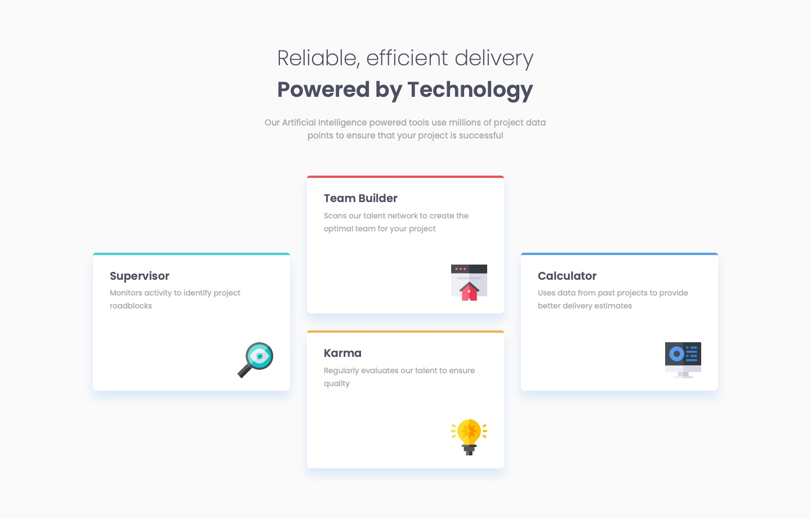

# Frontend Mentor - Four card feature section solution

This is a solution to the [Four card feature section challenge on Frontend Mentor](https://www.frontendmentor.io/challenges/four-card-feature-section-weK1eFYK). Frontend Mentor challenges help you improve your coding skills by building realistic projects. 

## Table of contents

- [Overview](#overview)
  - [Screenshot](#screenshot)
  - [Links](#links)
- [My process](#my-process)
  - [Built with](#built-with)
  - [What I learned](#what-i-learned)
  - [Continued development](#continued-development)
  - [Useful resources](#useful-resources)
- [Author](#author)
- [Acknowledgments](#acknowledgments)

## Overview

### Screenshot



### Links

- Live Site URL: [projects.jagur.dev/frontendmentor/four-card-feature-section-master](https://projects.jagur.dev/frontendmentor/four-card-feature-section-master)

## My process

### Built with

- Good ole HTML and CSS

### What I learned

#### 1. Complex Grid Layout
The grid layout for the desktop design of the cards for this project were particularly challenging. It took some trial and error, but ultimately I came up with a solution that I like:
```css
@container (width >= 60rem) {
  display: grid;
  grid-template-columns: repeat(3, 1fr);
  grid-template-rows: repeat(2, 1fr);
  align-items: center;

  > :nth-child(1),
  > :nth-child(4) {
    grid-row: span 2;
  }

  > :nth-child(2) {
    grid-area: 1 / 2;
  }

  > :nth-child(3) {
    grid-area: 2 / 2;
  }
}
```
A breakdown of this code:
- a grid with 3 columns and 2 rows
- ensure the height of the grid-items don't expand 100% and ensure the cards are centered vertically with `align-items: center`
- ensure the 1st and 4th cards take up the first and third columns respectively
- place the 2nd card in the second column in the first row
- place the 3rd card in the second column in the second row

#### 2. Clamp
This was my first time playing around with `clamp`. I used it for the font size of `h1` and for, where I most enjoyed using it, the height of `.card`:
```css
min-height: clamp(23ch, 23cqi, 26ch);
```
This code responsively adjusts the height of the card. `23cqi` makes the card's height grow and shrink based on the width of the container, `.card-deck` in this case. 

#### 3. Using a Wrapper for `header` and `main`
Up until now I've tried avoiding using wrappers. I know it's a very common practice to have wrappers everywhere in the HTML. I had to cave with this project and put a wrapper to separate `header` and `main` from the `footer`... so the HTML l layout looks like this:
```html
<div class="main-wrapper">
  <header>
  <main>
</div>
<footer>
```
This was the only way I could find to properly place the footer. I wanted to keep the layout I had come up with before placing the footer, but having `header`, `main`, and `footer` all under `body` proved a challenge in placing the footer where I wanted it.

### Continued development

- More practice with complex grid layouts
- More practice with full-document layout (like the layout I had to solve for this project with the `main-wrapper`)
- Continue experimenting with `clamp`
- Continue experimenting with container queries and container query length units

### Useful resources

- [Kevin Powell (YouTube)](https://www.youtube.com/@KevinPowell) - The man himself. I have to attribute a lot of my learnings to him. His videos are amazing and I would not be practicing nor learning as quickly as I am without him. Specifically for this project, these were the videos I took inspiration from:
  - [Learn how to use Media queries & Container queries (Video)](https://youtu.be/2rlWBZ17Wes?si=IvjZcMzNM9J_VuDg)
  - [Responsive layout practice for beginners (Video)](https://youtu.be/JFbxl_VmIx0?si=RKqHTSD2QsFxftyj) - in this video he works through this exact project. I decided to abstain from watching the video until I have finished committing everything for this project on my own. I am curious to see his solution and where we diverged.

- [MDN Web Docs](https://developer.mozilla.org/en-US/) - I always have multiple tabs of the Web Docs open while doing web dev. It is invaluable, and came in big help while practicing with new things like `clamp` and container queries in this project. I also stole the `.main-wrapper` from them for my wrapper.

- [Open Props](https://open-props.style) - I almost always have this website open while working on web dev. Although I didn't use the framework in this project, I like using their variable conventions for colors, theming, and typography.

## Author

- Website - [jagur.dev](https://jagur.dev)

## Acknowledgments

As always, I have to acknowledge the man [Kevin Powell (YouTube)](https://www.youtube.com/@KevinPowell). I wouldn't be having so much fun learning frontend without him. I didn't think I would enjoy frontend web development before I discovered his videos. In his intro to his videos he says he "helps people fall in love with CSS, or at least not be frustrated by it."
