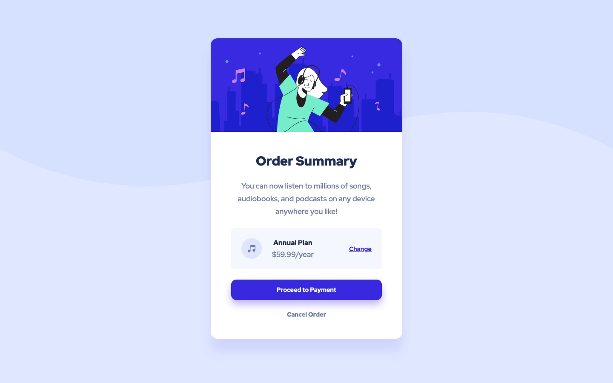

# Frontend Mentor - Order summary card solution

This is a solution to the [Order summary card challenge on Frontend Mentor](https://www.frontendmentor.io/challenges/order-summary-component-QlPmajDUj). Frontend Mentor challenges help you improve your coding skills by building realistic projects. 

## Table of contents

- [Overview](#overview)
  - [Screenshot](#screenshot)
  - [Links](#links)
- [My process](#my-process)
  - [Built with](#built-with)
  - [What I learned](#what-i-learned)
  - [Continued development](#continued-development)
  - [Useful resources](#useful-resources)
- [Author](#author)
- [Acknowledgments](#acknowledgments)

## Overview

### Screenshot



### Links

- Live Site URL: [projects.jagur.dev/frontendmentor/order-summary-component-main](https://projects.jagur.dev/frontendmentor/order-summary-component-main)

## My process

### Built with

- Good ole HTML and CSS

### What I learned

#### 1. Setting the Background
Working to through of setting this particular background with the svg with the color underneath was a challenge at first, but made sense once I found the solution. This is the code for the background:
```css
background: repeat-x url('images/pattern-background-desktop.svg') var(--surface-3);
```
Shoutout to [MDN](https://developer.mozilla.org/en-US/) and their page on [CSS background](https://developer.mozilla.org/en-US/docs/Web/CSS/background).

#### 2. Auto Margin with Flex
Using `display: flex` combined with `margin-[direction]: auto` easily forces elements all the way to the right/left. I used it in this solution to force the `Change` button to the end of the `div` with basically this code:
```css
.parent {
  display: flex;
}

.child {
  margin-right: auto;
}
```
Setting `margin-right: auto` on the plan details `div` did the trick.

#### 3. Using CSS Nesting
I have really enjoyed using the nesting CSS selectors feature. I know this is a farily new feature to vanilla CSS, and was a big reason to use Sass. I think it makes the CSS code mutch cleaner and easier for me to read & write. It really allows me to write CSS the way my brain thinks about it.

I have especially enjoyed using it with media queries. One example from this project:
```css
.card .plan {
  padding: 1.5rem;
  display: flex;
  gap: 1.5rem;

  @media (max-width: 480px) {
    padding: 1rem;
    gap: 1rem;
  }
```
Is much more enjoyable for me to read and write than:
```css
.card .plan {
  padding: 1.5rem;
  display: flex;
  gap: 1.5rem;

@media (max-width: 480px) {
  .card .plan {
    padding: 1rem;
    gap: 1rem;
  }
}
```
To me, the nested `@media` query makes much more sense.

### Continued development

- More practice with setting svgs and backgrounds
- More practice, intuition, and know-how with using grid and flexbox
- Develop more of an *eye* or *feel* for correct spacing. This includs spacing between elements, padding of elements, and spacing for paragraph lines.
- Continue developing with nesting CSS and develop a best-practice or a method for when to use it.

### Useful resources

- [From Design to Code // HTML & CSS from scratch // Frontend Mentor by Kevin Powell (VIDEO)](https://youtu.be/KqFAs5d3Yl8?si=eTTWNNGRSgujTvge) - Linked to this in my previous solution but this walkthrough is of huge value. Really provides an excellent breakdown of how to approach and build the front-end.

- [Want CSS variables in media query declarations? Try this! (bholmes.dev)](https://bholmes.dev/blog/alternative-to-css-variable-media-queries/) - an excellent and simple article that answered the questions I was trying to solve: "do variables work for media queries, and if not, is there a workaround?" This is a very lovely website and I have saved it for future inspiration for when I build my own personal website.

- [OpenProps](https://open-props.style) - did not use their styling, but I did use their themeing conventions while creating my CSS variables for colors and font sizes. An excellent resource that I have used in my website projects.

## Author

- Website - [jagur.dev](https://jagur.dev)

## Acknowledgments

I am forever thankful to [Kevin Powell (YouTube)](https://www.youtube.com/@KevinPowell). He is an invaluable resource and I always watch his videos before starting on a new project or when I'm just in search of new tips, advice, and how-tos. An absolute boon of a resource. A great guy, nothing but love and respect.
