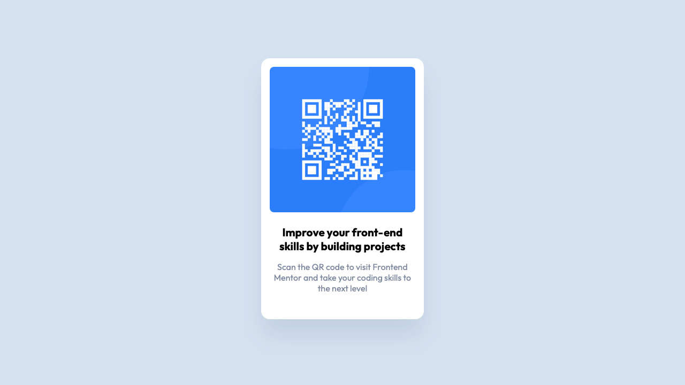

# Frontend Mentor - QR code component solution

This is a solution to the [QR code component challenge on Frontend Mentor](https://www.frontendmentor.io/challenges/qr-code-component-iux_sIO_H). Frontend Mentor challenges help you improve your coding skills by building realistic projects. 

## Table of contents

- [Overview](#overview)
  - [Screenshot](#screenshot)
  - [Links](#links)
- [My process](#my-process)
  - [Built with](#built-with)
  - [What I learned](#what-i-learned)
  - [Continued development](#continued-development)
  - [Useful resources](#useful-resources)
- [Author](#author)
- [Acknowledgments](#acknowledgments)

## Overview

### Screenshot



### Links

- Live Site URL: [projects.jagur.dev/frontendmentor/qr-code-component-main](https://projects.jagur.dev/frontendmentor/qr-code-component-main/)

## My process

### Built with

- Good ole HTML and CSS

### What I learned

#### 1. Write out the HTML first!
Writing out the HTML while planning ahead as to what the CSS is going to look like really does make organization and planning much easier. I'm sure I will improve on this as I work on more frontend code, but visualizing what the CSS classes might look like and how those classes could be reused really helped.

#### 2. Using raw HSL values as variables and plugging those into color variables
Source of this learning: [Kevin Powell's 'From Design to Code // HTML & CSS from scratch // Frontend Mentor' video](https://youtu.be/KqFAs5d3Yl8?si=jmExPT1NddODeUUM)
```css
:root {
  --hsl-white: 0, 0%, 100%;
  --hsl-light-gray: 212, 45%, 89%;
  --hsl-gray-blue: 220, 15%, 55%;
  --hsl-dark-blue: 218, 44%, 22%;

  --white: hsl(var(--hsl-white));
  --surface: hsl(var(--hsl-light-gray));
  --text-1: hsl(var(--hsl-gray-blue));
}
```
- The benefit of this trick is that you can use the raw HSL values throughout the css code pluggined into `hsla` values if needed. Or just use the regular theme variables if no adjustment to opacity is needed.

#### 3. Easily center `main` inside `body`
These two code snippets:
```css
body {
  height: 100vh;
}
```
```css
main {
  height: 100%;
  display: grid;
  place-items: center;
}
```
together are *chef's kiss*

#### 4. Easily place a footer
These two code snippets:
```css
body {
  display: flex;
  flex-direction: column;
}
```
```css
footer {
  justify-self: flex-end;
}
```
together easily place the footer at the bottom exactly as expected. Just make sure `main`'s height is `100%`. (used in this project for the attribution)

#### 5. Taking screenshots in Safari is easy
Source of this learning: [HOW TO TAKE A SCREENSHOT OF AN ENTIRE WEBPAGE IN SAFARI ON A MAC](https://eshop.macsales.com/blog/76508-take-a-screenshot-of-an-entire-webpage/)

Used this for the screenshot above. It's extremely simple and I love how you can choose which HTML element to screenshot. Here are the basic steps:

1. Open Web Inspector
2. Right-click the element to screenshot (for the whole page, right-click `<html>`)
3. Click `Capture Screenshot`

The beauty of this is that you can also choose to hide elements before screenshotting. (I chose to hide the `<footer>` element before screenshotting in order to hide the attribution.)

### Continued development
Definitely loving learning grid and flexbox. Will continue to learn and explore more. They really are extremely powerful and even fun to use.

### Useful resources

The first 2 resources were referenced earlier in the [What I Learned](#what-i-learned) section:

- [From Design to Code // HTML & CSS from scratch // Frontend Mentor by Kevin Powell (VIDEO)](https://youtu.be/KqFAs5d3Yl8?si=eTTWNNGRSgujTvge) - I would have been lost and my code would have been much more messy were it not for this video. A great walkthrough of going from a design to coding it.

- [HOW TO TAKE A SCREENSHOT OF AN ENTIRE WEBPAGE IN SAFARI ON A MAC](https://eshop.macsales.com/blog/76508-take-a-screenshot-of-an-entire-webpage/) - it's extremely simple. And it allows for customizing which elements you want to show or not in your screenshot.

- [OpenProps](https://open-props.style) - though I did not use their styles, I did try and use their theming conventions while creating my color variables in CSS.

## Author

- Website - [jagur.dev](https://www.jagur.dev)

## Acknowledgments

This is my first Frontend Mentor project, and I have to shoutout the man [Kevin Powell (YouTube)](https://www.youtube.com/@KevinPowell). I would not have taken the route I am currently taking to learning Frontend development without this man's videos. I would not be learning so rapidly were it not for all of the amazing information he gives. Nothing but love and respect for him.
